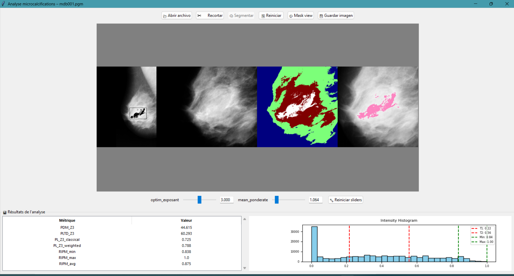

# 🩻 Détection automatique des microcalcifications sur mammographies

> Interface interactive pour l'aide au diagnostic des microcalcifications, réalisée avec **Python, OpenCV et Tkinter**.

---

## 🎯 Objectif

Ce projet vise à fournir aux **radiologues** une aide au diagnostic visuel supplémentaire pour la **localisation rapide et précise des microcalcifications** sur des mammographies. Ces calcifications peuvent être des **indicateurs précoces du cancer du sein**, d’où l’importance de leur détection automatique.

---

## 🖼️ Aperçu de l'interface

- 📂 Chargement d’une image mammographique (format JPG, PNG, PGM, DICOM…)
- ✂️ Recadrage manuel de la région d’intérêt (ROI)
- 📊 Segmentation dynamique avec réglage de deux paramètres :
  - `optim_exposant` : pondération d’optimisation d'exposant
  - `mean_ponderate` : pondération de moyenne locale
- 🎯 Résultats affichés sous forme d’images et de métriques
- 💾 Option de sauvegarde des résultats

---

## ⚙️ Fonctionnalités principales

- Interface utilisateur graphique (Tkinter + OpenCV)
- Recadrage interactif de la zone d’analyse
- Algorithme de **segmentation Multi-Otsu** optimisé
- Détection de zones suspectes colorisées en **rose**
- Calcul de **métriques quantitatives** pour l’aide au diagnostic :
  - `PLTD`, `PDM`, `PL_classical`, `PL_weighted`
  - `RIPM_min`, `RIPM_max`, `RIPM_avg`...

---

## 📁 Arborescence du projet

